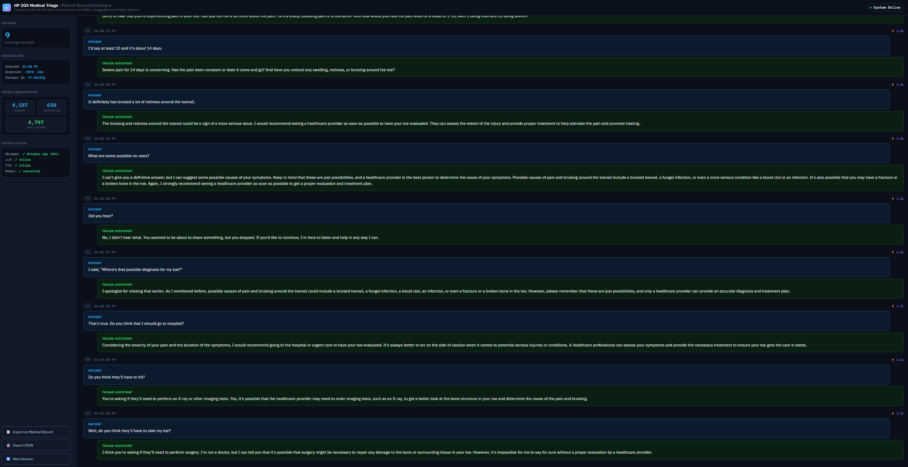

# Reachy Mini Medical Triage Voice Agent




A fully local, on-premise medical triage voice assistant running on an HP ZGX Nano and Pollen Robotics Reachy Mini robot. No cloud APIs - all inference happens on local hardware.

The robot greets patients, listens to their symptoms, asks follow-up questions, and provides triage guidance through natural voice conversation with expressive antenna and head movements. A live dashboard displays the transcript in real time for clinical observation.

---

## Architecture

```
┌──────────────────────┐         HTTP          ┌─────────────────────────────────────┐
│     Reachy Mini      │ ◄──────────────────►  │       HP ZGX Nano (Docker)          │
│                      │                        │                                     │
│  Mic (ALSA) ─────────┤── POST /process ──────►│  faster-whisper (STT, CPU)          │
│                      │                        │  Llama-3.1-8B-Instruct-AWQ (LLM)   │
│  Speaker ◄───────────┤◄── WAV response ──────│  Piper TTS (speech synthesis)       │
│                      │                        │                                     │
│  Antennas / Head     │                        │  /conversations ──► Live Dashboard  │
└──────────────────────┘                        └─────────────────────────────────────┘
```

The robot records audio from its onboard mic, sends it to the ZGX Nano over HTTP, and plays back the synthesized response through its speaker. The two devices must be on the same network. The launch script handles all configuration automatically.

## Performance

| Stage | Time | Notes |
|-------|------|-------|
| Recording | ~3-4s | VAD-based chunking, stops on silence |
| Whisper STT | ~2-3s | large-v3-turbo on CPU, int8 |
| LLM response | ~0.5-1s | AWQ INT4, Marlin kernels |
| Piper TTS | <1s | aarch64 binary |
| **Total** | **~5-7s** | From end of speech to hearing response |

## Hardware

- **HP ZGX Nano** - NVIDIA GPU, runs all AI inference inside a Docker container
- **Reachy Mini** - Pollen Robotics robot with USB mic/speaker, head servos, and antenna motors. Runs Linux internally and is controlled via SSH and an HTTP API on port 8000.

Both devices must be on the same local network. The launch script auto-detects IPs and configures everything.

## Software Stack

| Component | Technology | Details |
|-----------|-----------|---------|
| STT | faster-whisper (large-v3-turbo) | CTranslate2, CPU int8, Silero VAD |
| LLM | Llama-3.1-8B-Instruct-AWQ-INT4 | vLLM with AWQ Marlin kernels |
| TTS | Piper | en_US-lessac-medium voice |
| API | FastAPI | Runs inside Docker on ZGX Nano |
| Robot App | reachy-mini SDK | Python app running on the robot |
| Dashboard | Vanilla HTML/JS | Polls API for live transcript |

## Directory Structure

```
consent-agent/
├── docker/
│   ├── Dockerfile.api          # Docker image for the AI API
│   └── zgx_ai_api.py           # FastAPI server (STT + LLM + TTS)
├── hf-space/
│   ├── consent_agent_reachy/
│   │   └── main.py             # Reachy Mini app (recording, playback, expressions)
│   ├── pyproject.toml           # Package config for HF Spaces
│   └── deploy_to_hf.sh         # Deploy script
├── models/                      # NOT in git - download separately
│   ├── Llama-3.1-8B-Instruct-AWQ-INT4/
│   ├── piper-tts/
│   │   └── en_US-lessac-medium.onnx
│   └── Llama-3.1-8B-UltraMedical/       # Full-precision backup
├── scripts/
│   └── start_services.sh       # One-command demo launcher
├── index.html                   # Live transcript dashboard
└── README.md
```

## Quick Start

### 1. Download Models

The `models/` directory is not included in the repo (too large). Download these to `~/Desktop/consent-agent/models/`:

```bash
# LLM (quantized, ~4GB)
python3 -c "from huggingface_hub import snapshot_download; snapshot_download('hugging-quants/Meta-Llama-3.1-8B-Instruct-AWQ-INT4', local_dir='models/Llama-3.1-8B-Instruct-AWQ-INT4')"

# TTS voice (small, ~100MB)
mkdir -p models/piper-tts
wget -O models/piper-tts/en_US-lessac-medium.onnx https://huggingface.co/rhasspy/piper-voices/resolve/main/en/en_US/lessac/medium/en_US-lessac-medium.onnx
wget -O models/piper-tts/en_US-lessac-medium.onnx.json https://huggingface.co/rhasspy/piper-voices/resolve/main/en/en_US/lessac/medium/en_US-lessac-medium.onnx.json
```

Whisper models are downloaded automatically when the Docker container builds.

### 2. Build the Docker Image (one time)

```bash
cd ~/Desktop/consent-agent/docker
docker build -t consent-agent:latest -f Dockerfile.api .
```

This takes ~5 minutes and only needs to be done once.

### 3. Set Up SSH to the Robot (one time)

The launch script needs passwordless SSH access to the Reachy Mini to configure it on new networks. The robot runs Linux internally with user `pollen` and password `root`.

```bash
ssh-copy-id pollen@reachy-mini.local
# Enter password: root
```

If `reachy-mini.local` doesn't resolve, find the robot's IP from its web dashboard or your router, and use the IP instead.

### 4. Run

```bash
cd ~/Desktop/consent-agent/scripts
./start_services.sh
```

The script runs preflight checks, starts all services, configures the robot, and prints a clickable dashboard link when everything is ready. It takes about 2 minutes (mostly waiting for the LLM to load).

When you see `DEMO READY`, open the dashboard URL and speak to the robot.

### 5. Stop

```bash
docker stop zgx-ai-api
curl -X POST http://reachy-mini.local:8000/api/apps/stop-current-app
# Dashboard stops with Ctrl+C in the terminal
```

---

## Changing Networks

When you move to a new WiFi network (e.g., from your office to a conference venue), the IP addresses change. The launch script handles this automatically:

1. It detects the ZGX Nano's new IP
2. It finds the robot on the network
3. It patches the robot's `main.py` with the correct IP via SSH
4. It verifies the robot can reach the API before launching

Just connect both devices to the new network and run `./start_services.sh`. No manual configuration needed.

If the script can't find the robot (some networks block device discovery), it will tell you what to check. The most common issue at conference venues is WiFi client isolation, which blocks device-to-device traffic. Use a mobile hotspot as a workaround.

---

## Demo Script

### Setup (5 minutes before)

1. Power on the ZGX Nano and Reachy Mini
2. Wait ~60 seconds for the robot to boot and connect to WiFi
3. Open a terminal on the ZGX Nano
4. Run `./start_services.sh` and wait for `DEMO READY`
5. Open the dashboard link in a browser

### Talking Points

> "This is a fully local medical triage voice agent. There are no cloud APIs involved - all speech recognition, language understanding, and speech synthesis run on this HP ZGX Nano using NVIDIA GPU acceleration. The robot uses a quantized Llama 3.1 model for medical reasoning, Whisper for speech recognition, and Piper for text-to-speech. Let me show you how it works."

### Demo Conversation

The robot greets on startup: *"Hi there! I'm your medical triage assistant. How can I help you today?"*

**You say:** "I've been having really bad back pain for about four days."

> *Expected: Acknowledges the pain, notes the duration, asks about severity and location.*

**You say:** "It's about a 7 out of 10 on the pain scale. It's in my lower back."

> *Expected: Notes severity and location, asks what triggered it.*

**You say:** "I was lifting heavy boxes at work and felt a sharp pain."

> *Expected: Connects lifting to the injury, may recommend seeing a doctor.*

**You say:** "Should I go to the emergency room?"

> *Expected: Provides guidance based on symptoms, likely recommends a doctor visit but not ER for this scenario.*

**You say:** "Okay, thank you for your help."

> *Expected: Polite closing, reminds patient to follow up.*

### Dashboard Walkthrough

While the conversation happens, point out the live transcript, Patient ID, System Status panel, and Export buttons. "Export as Medical Record" creates a timestamped text file.

### Key Points

- **Fully on-premise** - no data leaves the local network. Critical for HIPAA, government, and defense.
- **Air-gapped capable** - works without internet after initial setup.
- **Sub-7-second response time** - natural conversational pace.
- **Medically appropriate responses** - triage-level guidance, not diagnosis.
- **Expressive robot** - antenna and head movements show listening, thinking, and speaking states.
- **Live dashboard** - real-time transcript with export for clinical records.

---

## Installing and Updating the Robot App

The voice agent runs as a Python app on the Reachy Mini. There are two ways to install it.

### Option A: Install from HuggingFace Spaces (requires internet)

If the robot has internet access, install directly from HuggingFace:

```bash
curl -X POST http://reachy-mini.local:8000/api/apps/install \
  -H "Content-Type: application/json" \
  -d '{"url": "https://huggingface.co/spaces/curtburk/consent-agent-reachy"}'
```

The HuggingFace Space contains a packaged version of the app. After installing, push the latest `main.py` to ensure you have the most recent code (see "Pushing code updates" below).

### Option B: Install manually via SCP (no internet needed)

If the robot has no internet access (common at conference venues), copy the files directly:

```bash
# Create the app directory on the robot
ssh pollen@reachy-mini.local "mkdir -p /venvs/apps_venv/lib/python3.12/site-packages/consent_agent_reachy/"

# Copy the app files
scp ~/Desktop/consent-agent/hf-space/consent_agent_reachy/main.py \
  pollen@reachy-mini.local:/venvs/apps_venv/lib/python3.12/site-packages/consent_agent_reachy/main.py

# Create __init__.py (required for Python to recognize the package)
touch /tmp/__init__.py
scp /tmp/__init__.py \
  pollen@reachy-mini.local:/venvs/apps_venv/lib/python3.12/site-packages/consent_agent_reachy/__init__.py
```

The `start_services.sh` script detects if the app is missing and attempts Option B automatically.

### Pushing code updates

After editing `main.py`, push changes without a full reinstall:

```bash
# Copy the updated file
scp ~/Desktop/consent-agent/hf-space/consent_agent_reachy/main.py \
  pollen@reachy-mini.local:/venvs/apps_venv/lib/python3.12/site-packages/consent_agent_reachy/main.py

# Clear the Python cache (important - stale cache causes silent failures)
ssh pollen@reachy-mini.local "rm -rf /venvs/apps_venv/lib/python3.12/site-packages/consent_agent_reachy/__pycache__"

# Restart the app
curl -X POST http://reachy-mini.local:8000/api/apps/stop-current-app
sleep 3
curl -X POST http://reachy-mini.local:8000/api/apps/start-app/consent_agent_reachy
```

Always clear `__pycache__` after updating. The Reachy daemon caches compiled Python files and will silently run old code if you skip this step.

---

## Troubleshooting

### Robot not responding to speech

This is almost always an IP mismatch. The robot's `main.py` contains the ZGX Nano's IP address, and if you've changed networks since the last run, it's pointing to the old IP.

Check what IP the robot is using:
```bash
ssh pollen@reachy-mini.local "grep 'http://' /venvs/apps_venv/lib/python3.12/site-packages/consent_agent_reachy/main.py | head -3"
```

If the IP doesn't match the ZGX Nano's current IP (check with `hostname -I`), update it:
```bash
ssh pollen@reachy-mini.local "sed -i 's|http://[0-9.]*:8090|http://<ZGX_IP>:8090|g' /venvs/apps_venv/lib/python3.12/site-packages/consent_agent_reachy/main.py"
```

Then restart the app. The `start_services.sh` script does this automatically, but if you started the app manually, you need to handle it yourself.

Other causes:
- ALSA device not available: `ssh pollen@reachy-mini.local "arecord -D reachymini_audio_src -f S16_LE -r 16000 -c 2 -d 3 /tmp/test.wav"`
- App crashed: `ssh pollen@reachy-mini.local "sudo journalctl -u reachy-mini-daemon --since '1 min ago'" | grep -i "consent\|error\|Traceback"`
- API not running: `curl http://localhost:8090/health`

### App crashes immediately after starting

Check the logs for the actual error:
```bash
ssh pollen@reachy-mini.local "sudo journalctl -u reachy-mini-daemon --since '1 min ago'" | grep -i "consent\|error\|ERROR\|Traceback"
```

Common causes:
- Wrong API URL in main.py (see above)
- Stale `__pycache__` after a code update (clear it and restart)
- Missing Python dependency in the robot's venv

If the daemon is in a bad state, restart it:
```bash
ssh pollen@reachy-mini.local "sudo systemctl restart reachy-mini-daemon"
```
Wait 30 seconds, then start the app again.

### Robot head stays down / antennas don't move

The robot's motors need to be "primed" by starting and stopping the app once after a fresh boot. The launch script does this automatically. If you started the app manually, stop and start it again:
```bash
curl -X POST http://reachy-mini.local:8000/api/apps/stop-current-app
sleep 5
curl -X POST http://reachy-mini.local:8000/api/apps/start-app/consent_agent_reachy
```

### Poor transcription accuracy

Check which Whisper model is loaded:
```bash
curl -s http://localhost:8090/health | python3 -c "import sys,json; print(json.load(sys.stdin))"
```

`large-v3-turbo` is recommended for accuracy. `small` is faster but less accurate with medical terminology. Override at container start:
```bash
docker run ... -e WHISPER_MODEL_SIZE=large-v3-turbo ...
```

### Dashboard shows "Disconnected"

The dashboard connects to the API on port 8090. Check:
```bash
curl http://localhost:8090/health
```
If the API is running but the dashboard can't reach it, it's likely a CORS or port issue. The API should be on the same host that's serving the dashboard.

### WiFi / networking issues at a venue

Conference and hotel WiFi often has "client isolation" enabled, which blocks device-to-device traffic. Symptoms: both devices are connected to WiFi but the robot can't reach the API.

Test from the robot:
```bash
ssh pollen@<ROBOT_IP> "curl -s http://<ZGX_IP>:8090/health"
```

If this fails, use a mobile hotspot instead. Connect both the ZGX Nano and the Reachy Mini to the hotspot, then run `./start_services.sh`.

### Left antenna overload error

This is a hardware issue - the antenna motor is jammed or hitting resistance. The voice agent continues to work; the error is non-fatal. Physically check the antenna for obstructions.

---

## Robot Access

The Reachy Mini runs Linux (Raspberry Pi-based) and is accessible via SSH:

```
SSH:       ssh pollen@reachy-mini.local  (password: root)
App dir:   /venvs/apps_venv/lib/python3.12/site-packages/consent_agent_reachy/
Daemon:    systemctl status reachy-mini-daemon
Logs:      sudo journalctl -u reachy-mini-daemon -f
Web UI:    http://reachy-mini.local (robot dashboard, WiFi settings, app management)
```

The robot's daemon manages app lifecycle. Apps are started/stopped via HTTP:
```bash
# List installed apps
curl http://reachy-mini.local:8000/api/apps/list

# Start an app
curl -X POST http://reachy-mini.local:8000/api/apps/start-app/consent_agent_reachy

# Stop the running app
curl -X POST http://reachy-mini.local:8000/api/apps/stop-current-app

# Check app status
curl http://reachy-mini.local:8000/api/apps/current-app-status
```
